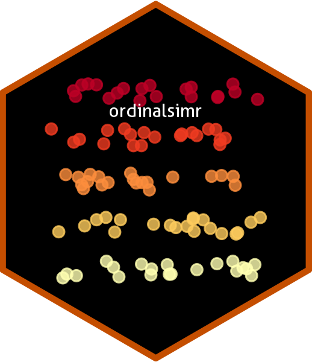

# ordinalsimr 

The {ordinalsimr} package assists in constructing simulation studies of
ordinal data comparing two groups. It is intended to facilitate
translation of methodological advances into practical settings for
e.g. applied statisticians and data analysts who want to determine an
appropriate statistical test to apply on their data or a proposed
distribution of data.

This package is primarily developed as a Shiny application which
abstracts away the heavier coding aspect of setting up simulation
studies. Instead, users can simply enter parameters and data
distributions into the application, and save the results as an `.rds`
file. The structure of the Shiny application only allows for one
simulation to be specified at a time as opposed to a grid of parameters.
However, the underlying functions for running the simulations are
accessible. See
[`vignette("ordinalsimr")`](https://neuroshepherd.github.io/ordinalsimr/articles/ordinalsimr.md)
for template code on setting up your own simulations manually.

## Installation

You can install the development version of ordinalsimr from GitHub with:

``` r
# install.packages("devtools")
devtools::install_github(
  "NeuroShepherd/ordinalsimr",
  build_vignettes = TRUE
)
```

## Running the App

The app can be started with the following code:

``` r
ordinalsimr::run_app()
```

If using the app repeatedly, it may be useful to change some of the
options in the application to suit your needs. See the vignette
“ordinalsimr-options” for more information,
[`vignette("ordinalsimr-options", package = "ordinalsimr")`](https://neuroshepherd.github.io/ordinalsimr/articles/ordinalsimr-options.md).

## Recommendations

Simulations with 1000s of iterations *will* take minutes to hours to
run. This should generally be ok on the Shiny app, but if you encounter
issues, consider running the simulations in a separate R session using
the functions provided in this package (rather than the Shiny app). See
the vignette “coding-simulations” for more information,
[`vignette("coding-simulations", package = "ordinalsimr")`](https://neuroshepherd.github.io/ordinalsimr/articles/coding-simulations.md).
